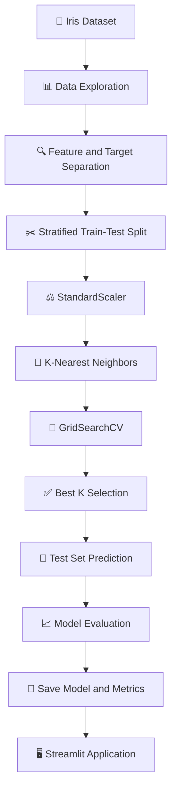

<div align="center">


# 🌸 Iris Intelligence Classifier

### An interactive Machine Learning application for classifying Iris flowers using K-Nearest Neighbors

<br>

[](https://www.python.org/)
[](https://scikit-learn.org/)
[](https://streamlit.io/)
[](https://pandas.pydata.org/)
[](https://plotly.com/)
[](https://pytest.org/)

<br>


</div>

---

## 📌 Project Overview

**Iris Intelligence Classifier** is an end-to-end supervised Machine Learning project developed as part of **DecodeLabs Artificial Intelligence — Project 2**.

The application trains a classification model to recognize the species of an Iris flower using four physical measurements:

- Sepal length
- Sepal width
- Petal length
- Petal width

The trained model classifies each flower into one of three species:

| Class ID | Iris Species |
|:---:|---|
| `0` | 🌸 Iris Setosa |
| `1` | 🌺 Iris Versicolor |
| `2` | 🌷 Iris Virginica |

The project includes data exploration, preprocessing, model training, hyperparameter tuning, evaluation, automated testing, and an interactive Streamlit interface.

---

## ✨ Key Features

<table>
<tr>
<td width="50%">

### 🤖 Machine Learning

- Supervised classification
- K-Nearest Neighbors algorithm
- Standard feature scaling
- Stratified train-test split
- Hyperparameter tuning
- Five-fold cross-validation
- Probability-based predictions

</td>
<td width="50%">

### 📊 Interactive Application

- Dataset exploration
- Statistical data summary
- Interactive Plotly visualizations
- Model performance dashboard
- Confusion matrix
- Classification report
- New flower prediction interface

</td>
</tr>

<tr>
<td width="50%">

### 📈 Model Evaluation

- Accuracy
- Precision
- Recall
- F1 Score
- Confusion Matrix
- Per-class performance
- Saved test predictions

</td>
<td width="50%">

### 🧪 Software Quality

- Modular project structure
- Reusable prediction service
- Automated Pytest tests
- Error handling
- Saved model artifacts
- Reproducible training pipeline

</td>
</tr>
</table>

---

## 📊 Dataset Snapshot

The project uses the built-in **Iris Dataset** provided by Scikit-learn.

| Dataset Property | Value |
|---|:---:|
| Total samples | **150** |
| Number of features | **4** |
| Number of classes | **3** |
| Training samples | **120** |
| Testing samples | **30** |
| Training ratio | **80%** |
| Testing ratio | **20%** |

### Feature Names

```text
sepal length (cm)
sepal width (cm)
petal length (cm)
petal width (cm)
```

### Class Distribution

The dataset is perfectly balanced:

| Species | Number of Samples |
|---|:---:|
| Iris Setosa | 50 |
| Iris Versicolor | 50 |
| Iris Virginica | 50 |
| **Total** | **150** |

```text
Target 0 — Setosa       ████████████████████ 50
Target 1 — Versicolor   ████████████████████ 50
Target 2 — Virginica    ████████████████████ 50
```

---

## 🧠 Machine Learning Pipeline



---

## ⚙️ Model Architecture

The classifier is implemented as a Scikit-learn `Pipeline`:

```text
Input Measurements
        │
        ▼
StandardScaler
        │
        ▼
K-Nearest Neighbors
        │
        ▼
Predicted Species + Class Probabilities
```

### Why StandardScaler?

KNN calculates distances between data points. Features with larger numerical ranges may dominate these distance calculations.

`StandardScaler` transforms each feature to a comparable scale before the KNN model processes it.

### Hyperparameter Tuning

The application tests several odd values of `K`:

```python
[1, 3, 5, 7, 9, 11, 13, 15]
```

`GridSearchCV` selects the best value using:

- Five-fold cross-validation
- Macro F1 Score
- Training data only

This provides a more reliable selection than manually choosing a single value of `K`.

---

## 🖥️ Application Pages

### 🏠 Home

Provides an overview of the project and displays:

- Total dataset samples
- Number of input features
- Number of target classes
- Best selected K value
- Machine Learning workflow

### 📊 Dataset Explorer

Allows users to:

- Browse all Iris records
- Review statistical summaries
- Explore class distribution
- Compare petal measurements
- Compare sepal measurements
- Display interactive feature distributions

### 📈 Model Evaluation

Displays:

- Accuracy
- Precision
- Recall
- F1 Score
- Confusion Matrix
- Classification Report
- Best K value

### 🔮 Predict Species

Allows users to enter:

- Sepal length
- Sepal width
- Petal length
- Petal width

The application returns:

- Predicted Iris species
- Probability for every class
- Interactive probability chart

### ℹ️ About

Explains the purpose, technologies, and Machine Learning concepts demonstrated by the project.

---

## 🗂️ Project Structure

```text
iris-intelligence-classifier/
│
├── app.py
│   └── Streamlit user interface
│
├── train_model.py
│   └── Dataset loading, training, tuning, and evaluation
│
├── requirements.txt
│   └── Project dependencies
│
├── pytest.ini
│   └── Pytest configuration
│
├── README.md
│   └── Project documentation
│
├── .gitignore
│   └── Files excluded from Git
│
├── src/
│   ├── __init__.py
│   └── model_service.py
│       └── Model loading and prediction functions
│
├── models/
│   ├── knn_iris_model.joblib
│   ├── model_metrics.json
│   └── test_predictions.csv
│
└── tests/
    └── test_model.py
        └── Automated prediction and probability tests
```

---

## 🛠️ Technology Stack

| Technology | Purpose |
|---|---|
| Python | Core programming language |
| Scikit-learn | Dataset, preprocessing, training, tuning, and evaluation |
| Streamlit | Interactive web application |
| Pandas | Data manipulation and analysis |
| NumPy | Numerical data processing |
| Plotly | Interactive data visualization |
| Joblib | Saving and loading the trained model |
| Pytest | Automated testing |
| Git & GitHub | Version control and project hosting |

---

## 🚀 Installation and Setup

### 1. Clone the Repository

```bash
git clone https://github.com/malakmohamed172/iris-intelligence-classifier.git
cd iris-intelligence-classifier
```

### 2. Create a Virtual Environment

#### Windows

```powershell
python -m venv .venv
```

Activate it using:

```powershell
Set-ExecutionPolicy -Scope Process -ExecutionPolicy Bypass
.\.venv\Scripts\Activate.ps1
```

#### Linux or macOS

```bash
python3 -m venv .venv
source .venv/bin/activate
```

### 3. Install Dependencies

```bash
python -m pip install --upgrade pip
python -m pip install -r requirements.txt
```

---

## 🧠 Train the Model

Run:

```bash
python train_model.py
```

The training script will:

1. Load the Iris Dataset.
2. Display the dataset structure.
3. Separate features and target classes.
4. Split the dataset into training and testing sets.
5. Apply feature scaling.
6. tune the KNN model.
7. Generate predictions.
8. Calculate evaluation metrics.
9. Save the trained model.
10. Save metrics and test predictions.

### Expected Dataset Output

```text
============================================================
IRIS INTELLIGENCE CLASSIFIER
============================================================

Dataset shape:
(150, 4)

Feature names:
[
    'sepal length (cm)',
    'sepal width (cm)',
    'petal length (cm)',
    'petal width (cm)'
]

Target classes:
['setosa', 'versicolor', 'virginica']

Class distribution:
0    50
1    50
2    50

Training samples: 120
Testing samples: 30
```

### Generated Model Files

After training, the following files are created:

```text
models/
├── knn_iris_model.joblib
├── model_metrics.json
└── test_predictions.csv
```

| File | Description |
|---|---|
| `knn_iris_model.joblib` | Complete trained Scikit-learn pipeline |
| `model_metrics.json` | Accuracy, precision, recall, F1, and confusion matrix |
| `test_predictions.csv` | Actual and predicted values for test samples |

---

## 🧪 Run Automated Tests

Run:

```bash
python -m pytest -v
```

Expected result:

```text
tests/test_model.py::test_prediction_returns_valid_species PASSED
tests/test_model.py::test_probabilities_sum_to_one PASSED

2 passed
```

The tests validate that:

- The model returns one of the three valid Iris species.
- Prediction probabilities add up to approximately `1.0`.

---

## ▶️ Run the Streamlit Application

```bash
python -m streamlit run app.py
```

The application will normally open at:

```text
http://localhost:8501
```

---

## 🔮 Example Predictions

### Iris Setosa

```text
Sepal Length: 5.1 cm
Sepal Width:  3.5 cm
Petal Length: 1.4 cm
Petal Width:  0.2 cm
```

Expected result:

```text
Iris Setosa
```

### Iris Versicolor

```text
Sepal Length: 6.0 cm
Sepal Width:  2.9 cm
Petal Length: 4.5 cm
Petal Width:  1.5 cm
```

Expected result:

```text
Iris Versicolor
```

### Iris Virginica

```text
Sepal Length: 6.5 cm
Sepal Width:  3.0 cm
Petal Length: 5.8 cm
Petal Width:  2.2 cm
```

Expected result:

```text
Iris Virginica
```

---

## 📏 Evaluation Metrics

The model is evaluated using multiple classification metrics.

### Accuracy

Measures the percentage of correctly classified test samples.

```text
Correct Predictions
──────────────────────────
Total Test Predictions
```

### Precision

Measures how many samples predicted as a particular species actually belong to that species.

### Recall

Measures how many samples belonging to a species were correctly identified.

### F1 Score

Represents the harmonic mean of precision and recall.

### Confusion Matrix

Shows the relationship between:

- Actual species
- Predicted species
- Correct classifications
- Misclassifications

The final values are generated during model training and stored inside:

```text
models/model_metrics.json
```

---

## 🔬 What This Project Demonstrates

This project demonstrates practical understanding of:

- Supervised learning
- Multi-class classification
- Dataset inspection
- Balanced class distributions
- Train-test splitting
- Data leakage prevention
- Feature scaling
- Distance-based algorithms
- Cross-validation
- Hyperparameter tuning
- Model evaluation
- Model persistence
- Interactive deployment
- Automated software testing

---

## ⚠️ Current Limitations

- The model is trained only on the standard Iris Dataset.
- Input values are limited to flower measurements.
- The dataset contains only 150 samples.
- KNN prediction performance may change with different scaling or K values.
- The application is designed for educational and portfolio purposes.

---

## 🔭 Future Improvements

- Compare KNN with Logistic Regression,---

## 🔭 Future Improvements

- Compare KNN Decision Tree, Random Forest, and SVM.
- Add model comparison charts.
- Add cross-validation performance visualization.
- Add downloadable prediction reports.
- Add batch prediction using CSV files.
- Deploy the application publicly.
- Track prediction history.
- Add advanced explainability visualizations.
- Add Docker support.
- Add continuous integration using GitHub Actions.

---

## 🎓 Project Context

This project was developed for:

```text
DecodeLabs
Artificial Intelligence Track
Project 2 — Data Classification Using AI
Batch 2026
```

The project represents the transition from rule-based systems to supervised Machine Learning, where a model learns patterns from labeled data and predicts the class of previously unseen samples.

---

## 👩‍💻 Author

<div align="center">

### Malak Mohammed Hussein

AI-Focused Software Engineering Student

[](https://github.com/malakmohamed172)
[](https://portifolio-malak.vercel.app/)

</div>

---

## ⭐ Support

If this project helped you understand supervised classification, consider giving the repository a star.

<div align="center">

### 🌸 From raw measurements to intelligent predictions


</div>
